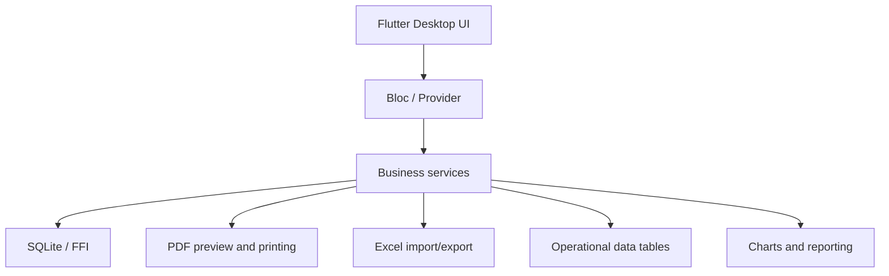

# Import & Export System — Desktop Operations Case Study

The Import & Export System is a Flutter Desktop product for a trading/shipment company. It supports offline internal operations, records management, document workflows, and day-to-day business tasks that need reliability more than flashy UI.

I worked on the system as an end-to-end Flutter engineer, focusing on stabilizing workflows, improving database behavior, and making the product more useful for daily desktop operations.

[Portfolio case](https://minaayman-portfolio.netlify.app/#/en/work)

---

## Summary

| Area | Details |
| --- | --- |
| Product | Desktop management system for trading/shipment operations |
| Role | Solo Flutter/Desktop Engineer |
| Platform | Desktop-first Flutter application |
| Core stack | Flutter Desktop, Dart, SQLite/FFI, Bloc, Provider, GetIt, Excel, PDF/printing, data tables, charts, maps |
| Main challenge | Replace slow/manual internal processes with reliable offline-first workflows |
| Key result | Faster data retrieval and fewer manual operations in core workflows |

---

## The problem

Internal business systems often fail in quiet ways: records are hard to search, operations depend on manual steps, and staff lose time moving between spreadsheets, documents, and disconnected tools.

For this project, the important requirements were practical:

- work reliably on desktop;
- keep core workflows available offline;
- handle structured records through SQLite;
- generate and view documents;
- import/export data when needed;
- support role-based usage;
- make tables, search, and daily operations faster.

---

## My role

I handled the implementation and product improvements across the desktop workflow.

My responsibilities included:

- building and stabilizing Flutter Desktop screens;
- structuring state with Bloc/Provider and dependency injection;
- improving SQLite/FFI-backed data workflows;
- supporting data tables for operational records;
- adding PDF generation/preview/printing flows;
- supporting Excel import/export style workflows;
- refining internal navigation and role-based access patterns;
- improving speed and reducing repeated manual actions.

---

## Architecture

The system was built around local-first desktop operations. SQLite/FFI gave the app a dependable local data layer, while Flutter Desktop handled UI consistency and cross-platform implementation.

---

## Engineering highlights

- Built offline-first desktop workflows with Flutter Desktop.
- Used SQLite/FFI for structured local records.
- Improved core data retrieval in important workflows.
- Reduced repeated manual operations through better flows.
- Added PDF generation, preview, and printing support.
- Supported Excel import/export style operations.
- Used data-table views for dense operational screens.
- Included charts/maps where they helped business visibility.
- Structured the app with state management and dependency injection for maintainability.

---

## Measurable outcomes

From the project notes used in my portfolio:

- data retrieval improved by about **40%** in targeted flows;
- manual operations were reduced by about **35%** in repeated workflows;
- core operations were made available in an offline-first desktop environment.

These numbers are less polished than a full analytics dashboard, but they still tell the real story: the system became faster and less manual for daily business use.

---

## What this project shows

This case study is important because desktop business software exposes different strengths than consumer mobile apps:

- dense information design;
- database performance;
- document generation;
- file import/export;
- operational reliability;
- workflow simplification.

It shows that I can build tools people use to run a business, not only public app-store experiences.

---

## What to ask me about this project

Useful discussion areas:

- how I approach offline-first desktop software;
- how I structure dense table-heavy screens;
- how SQLite/FFI changes Flutter Desktop behavior;
- how document generation and exports shape real business workflows;
- how I would measure retrieval speed more formally next time.

---

## Privacy note

This case study does not expose private company records, internal process details, credentials, or repository code. It focuses on public-safe engineering scope and product outcomes.
