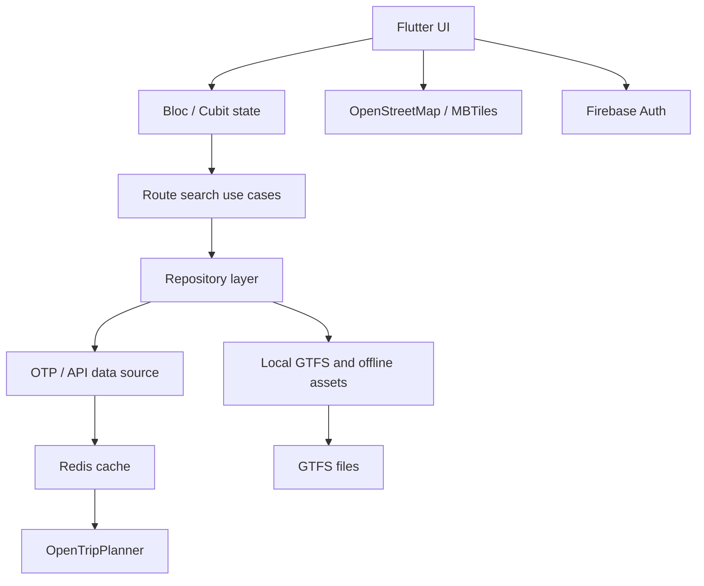

# SANOUKA — Public Transit & Navigation Case Study

SANOUKA is a public transit and navigation app for Abidjan, Côte d'Ivoire. It helps commuters search for routes, understand available transport options, view stops, and navigate through the city using public transport, walking segments, and offline map support.

I owned the project end-to-end as a solo Flutter/Product Engineer: app architecture, Flutter implementation, map experience, route search, authentication, GTFS integration, API integration, performance tuning, release work, and ongoing technical decisions.

---

## Summary

| Area | Details |
| --- | --- |
| Product | Public transit and city navigation app |
| Market | Abidjan, Côte d'Ivoire |
| Role | Solo Flutter Product Engineer |
| Platforms | Android, iOS work, Flutter app architecture |
| Core stack | Flutter, Dart, Firebase Auth, OpenStreetMap, GTFS, OpenTripPlanner, Cloud Run, Redis, MBTiles |
| Main challenge | Make complex transit routing fast, reliable, and usable on mobile |
| Key result | Route planning improved from roughly 2 minutes to under 10 seconds in common cases |

---

## The problem

Public transport information in many cities is fragmented. A user may need to understand routes, nearby stops, walking segments, vehicle types, and route timing while dealing with unstable connectivity or slow network conditions.

For SANOUKA, the technical challenge was not only showing a map. The product needed to combine several difficult pieces:

- official transit data through GTFS;
- route calculation through OpenTripPlanner;
- mobile map rendering and location services;
- geocoding and reverse-geocoding;
- offline map access;
- authentication and user sessions;
- performance good enough for everyday commuting.

---

## My role

I handled the project as an end-to-end owner, not as a narrow feature contributor.

My responsibilities included:

- designing the Flutter app structure;
- building feature modules with Clean Architecture;
- implementing route search and map flows;
- integrating OpenTripPlanner route planning;
- working with GTFS data and local transit files;
- adding Firebase authentication flows;
- improving route-search performance;
- adding offline map support using MBTiles;
- tuning API, caching, and infrastructure behavior;
- preparing production-ready builds and store-facing delivery work.

---

## Product and data scale

The app worked with a real transit dataset rather than small mock data.

Known data coverage included:

- **635** public transit routes;
- **7,251** transit stops;
- **29** transport agencies;
- **1,304** scheduled trips per day;
- local GTFS files bundled for offline access;
- Abidjan boundary/geofencing data;
- offline raster map tiles through MBTiles.

This pushed the app beyond a normal CRUD-style mobile project. Data loading, caching, parsing, routing, and UI responsiveness all mattered.

---

## Architecture

SANOUKA used a feature-based Clean Architecture structure.

The main reason for this structure was maintainability. Route search, maps, auth, onboarding, and offline services could evolve without turning the whole app into one large coupled module.

---

## Route planning challenge

The hardest product flow was route planning.

The app needed to send origin/destination coordinates to an OpenTripPlanner backend, process GTFS-backed route results, show transit legs, walking legs, intermediate stops, route names, polylines, and readable instructions.

Early route searches could take around **120 seconds** in some cases. That was not acceptable for a commuter experience.

I improved this by combining several changes:

- using Redis caching for repeated and similar route requests;
- reducing repeated OpenTripPlanner calculations;
- tuning Cloud Run resource choices around cost and speed;
- keeping a warm Cloud Run instance for critical route flows;
- improving request handling and route parsing;
- using fallbacks so users still get useful behavior when a service fails.

The result: common route-search scenarios dropped from roughly **2 minutes** to **6–10 seconds**.

That is approximately a **12x–20x improvement** in perceived route-search speed.

---

## Performance and cost tradeoff

One important decision was balancing infrastructure cost with user experience.

OpenTripPlanner can be resource-heavy. Keeping everything oversized would improve raw speed but increase client cost. Scaling everything down too aggressively would save money but hurt route-search latency and cold starts.

The final direction was a pragmatic middle ground:

- reduce unnecessary Cloud Run resource usage where possible;
- use Redis to avoid recalculating repeated route plans;
- keep minimum instances warm for critical routing availability;
- use caching and request deduplication to reduce backend pressure.

This is the kind of tradeoff I care about in production work: not just making something work, but making it usable, maintainable, and cost-aware.

---

## Offline maps

SANOUKA also included offline map support using raster MBTiles.

The app bundles Abidjan offline map tiles and copies them into app storage when needed. This improves the experience for users with limited or unstable connectivity.

The offline map workflow included:

- generating map tiles for a defined Abidjan bounding box;
- bundling the MBTiles asset with the Flutter app;
- copying the large asset safely to internal storage;
- serving tiles through a local MBTiles provider;
- integrating offline tiles into the map UI.

---

## Reliability and fallbacks

The app used multiple fallback layers because transit/navigation products cannot depend on a single happy path.

Examples:

- **Geocoding fallback:** OpenStreetMap Nominatim first, then Photon and Maps.co when needed.
- **Routing fallback:** OpenTripPlanner route planning, with local GTFS-backed behavior where useful.
- **Walking route support:** OSRM used for walking segments and geometry.
- **Offline access:** local GTFS and offline map tiles reduce dependency on live network availability.

---

## Engineering highlights

- Built a production Flutter app around real public-transport data.
- Integrated OpenTripPlanner 2.7 route planning with GTFS data.
- Added Redis caching to reduce route calculation latency and repeated backend work.
- Improved common route-search time from roughly 120 seconds to 6–10 seconds.
- Supported 635 routes, 7,251 stops, 29 agencies, and 1,304 scheduled trips per day.
- Added offline raster maps with MBTiles and local app storage management.
- Implemented Firebase authentication, email verification, and password recovery flows.
- Used Clean Architecture, Bloc/Cubit, and dependency injection for maintainable feature modules.
- Built multi-provider geocoding fallbacks for better reliability.
- Added performance monitoring for startup, navigation, memory, and network behavior.

---

## What I learned

This project taught me that the most important engineering work is often hidden from the UI.

A route card may look simple, but behind it there is data validation, GTFS parsing, OTP behavior, network reliability, map rendering, caching, infrastructure cost, and user patience.

SANOUKA pushed me to think less like a screen builder and more like a product engineer responsible for the full experience.

---

## Privacy note

This case study intentionally avoids exposing private repository code, credentials, deployment secrets, or sensitive infrastructure details. It focuses on the public-safe product story and engineering decisions.
