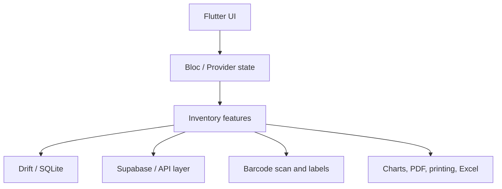

# Storix — Warehouse & Retail Inventory Case Study

Storix is a cross-platform inventory and warehouse-management product for retail businesses. It focuses on daily stock operations: products, quantities, movement tracking, suppliers, reporting, barcode flows, and operational visibility.

I owned the product as an end-to-end Flutter/Product Engineer: architecture, implementation, data layer decisions, UI workflows, local database behavior, Supabase integration, reporting/export flows, and production polish.

[Portfolio case](https://minaayman-portfolio.netlify.app/#/en/work) · [Live app](https://storix-app.netlify.app/)

---

## Summary

| Area | Details |
| --- | --- |
| Product | Warehouse and retail inventory management system |
| Role | Solo Flutter Product Engineer |
| Platforms | Flutter mobile/web/desktop-oriented architecture |
| Core stack | Flutter, Dart, Supabase, Drift/SQLite, Bloc, Provider, Dio, PDF/printing, Excel, barcode scanning |
| Main challenge | Make inventory operations reliable, searchable, and usable at real business scale |
| Key result | Designed around 100K+ inventory-record capacity and practical stock-movement workflows |

---

## The problem

Small and growing retail businesses often start with manual inventory processes. That works for a while, then breaks down when products, suppliers, stock movement, and reporting become harder to track.

The product needed to support practical business work rather than just CRUD screens:

- fast product and inventory lookup;
- stock movement tracking;
- barcode-oriented workflows;
- supplier and contact handling;
- printable/exportable business documents;
- local database reliability;
- a UI that can work across different screen sizes and workflows.

---

## My role

I worked as the end-to-end builder, which means I was responsible for both product behavior and technical execution.

My responsibilities included:

- designing the app structure and feature boundaries;
- building Flutter UI flows for inventory operations;
- implementing local data persistence with Drift/SQLite;
- integrating Supabase-backed operations where needed;
- adding barcode scanning and barcode generation flows;
- supporting PDF/printing and Excel workflows;
- handling charts and reporting views;
- improving responsiveness and maintainability across platforms.

---

## Architecture and product decisions

Storix is not just a mobile form app. Inventory systems need stable data behavior, predictable state, and workflows that do not collapse when the dataset grows.

Important engineering choices included:

- local database support through Drift/SQLite for structured business data;
- Supabase integration for backend-backed workflows;
- Bloc/Provider patterns for predictable state and screen behavior;
- Dio-based API communication where remote calls are required;
- PDF, printing, and Excel support for business-facing output;
- barcode scanning/generation to reduce manual entry.

---

## Engineering highlights

- Built a Flutter inventory product around real retail workflows.
- Designed for 100K+ inventory-record capacity.
- Added stock movement tracking as a core workflow, not an afterthought.
- Used Drift/SQLite for structured local persistence.
- Integrated Supabase for backend-backed operations.
- Added barcode scanning and barcode generation support.
- Supported Excel import/export style workflows.
- Added PDF and printing flows for business documents.
- Built responsive, modular UI suitable for operational use.

---

## What this project shows

Storix is useful as portfolio evidence because it shows product engineering beyond pretty UI:

- data modeling;
- offline/local persistence;
- operational workflows;
- reporting and exports;
- barcode and printing support;
- end-to-end ownership.

That combination matters for businesses because the product has to support daily work, not just look good in a screenshot.

---

## What to ask me about this project

Useful discussion areas:

- why I chose a local database layer for inventory workflows;
- how barcode workflows reduce operational friction;
- how PDF/printing/Excel changed the product from app UI into business software;
- where Supabase fits in the operational model;
- what I would instrument next to measure stock-flow speed more accurately.

---

## Privacy note

This case study avoids exposing private business data, secrets, deployment details, or client-specific internals. It focuses on public-safe architecture, product decisions, and engineering scope.
