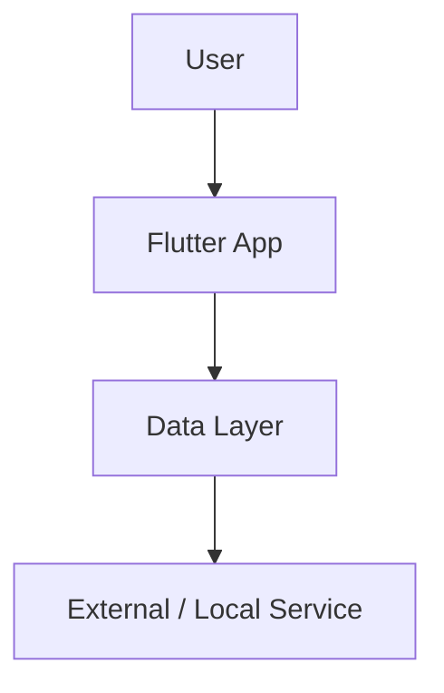

# Project Name — Case Study

One-sentence summary of the product and why it matters.

---

## Summary

| Area | Details |
| --- | --- |
| Product |  |
| Role |  |
| Platforms |  |
| Core stack |  |
| Main challenge |  |
| Key result |  |

---

## The problem

What real user, business, or operational problem existed before the product or feature?

---

## My role

What did I personally own?

- Architecture:
- UI implementation:
- API/backend integration:
- Data/offline work:
- Performance:
- Release/deployment:

---

## Technical challenge

What made this hard technically?

---

## Solution

What did I build or change?

---

## Results

Use exact numbers if available. If not, use honest approximate language.

- Before:
- After:
- Impact:

---

## Engineering highlights

- 
- 
- 

---

## What I learned

What did this project teach me about product engineering?

---

## Privacy note

This case study avoids private source code, credentials, customer data, and deployment secrets.
